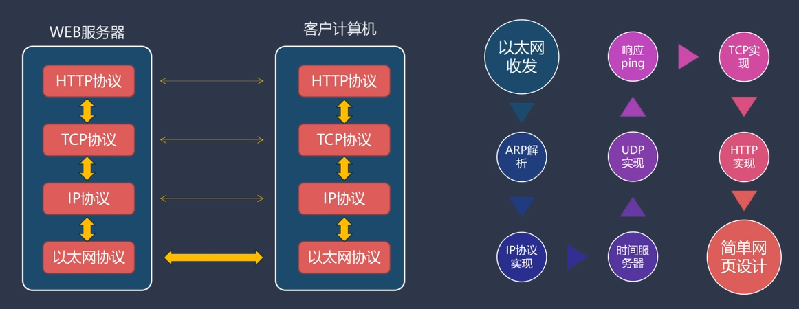
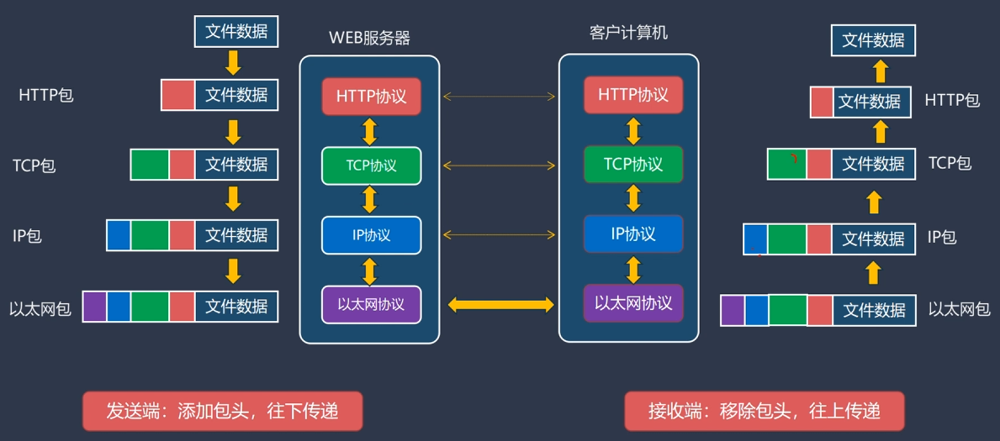

# HandmadeTCPIP ✉️📦

> “当别人还在调用 `send()`，我已经开始自己封装 IP 包头了。”  
> —— 一位打算亲手包办三次握手的 C++ 程序员

## 🧠 项目简介

这个仓库是我跟着 **李述铜老师** 的课程《**从 0 开始手写 TCP/IP 协议栈**》边学边写的实战项目，从 **网卡驱动层** 一步步手搓 **完整的 TCP/IP 协议栈**，不依赖操作系统网络栈。

## 🚀 当前进度（持续更新中）

- [x] 整体结构设计 
- [x] 调试信息输出
- [x] 设计通用的链表结构
- [x] 定长内存块管理
- [x] 定长消息队列的实现
- [x] 网络数据包结构设计
- [x] 网络接口层设计
- [x] 支持以太网协议
- [ ] 定时器的实现
- [ ] 支持ARP协议
- [ ] 初步支持IP协议
- [ ] 支持ICMP协议
- [ ] IP数据报的分片与重组
- [ ] 设计自己的ping命令
- [ ] ......

> 📌 总目标：让电脑用自己写的协议栈上网（顺便抖一抖网卡）

## 📸 项目预览

## 📚 学习资料

- 李述铜：[从0开始手写TCP/IP协议栈](https://www.yuque.com/lishutong-docs/tcpip)
- W. Richard Stevens：[TCP/IP详解](https://book.douban.com/subject/26825411/)